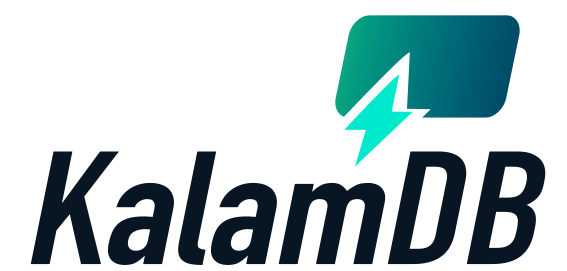

<p align="center">
  
</p>

# KalamDB (Alpha)

[](https://www.rust-lang.org/)
[](https://www.apache.org/licenses/LICENSE-2.0)
[](https://github.com/jamals86/KalamDB/actions/workflows/ci.yml)
[](https://github.com/jamals86/KalamDB/actions/workflows/ci.yml)
[](https://github.com/jamals86/KalamDB/releases)
[](https://hub.docker.com/r/jamals86/kalamdb)

KalamDB is a SQL-first realtime state database for AI agents, chat products, and multi-tenant SaaS.
It combines SQL execution, live subscriptions, pub/sub streams, and hot/cold storage in one Rust runtime.

> Frontend clients can execute SQL directly against KalamDB. This is not only a backend database layer.

## Frontend-First SQL Execution

To avoid confusion: KalamDB is designed for both frontend and backend SQL execution.

- Frontend (web/mobile/desktop): run SQL for user-scoped reads/writes and realtime subscriptions.
- Backend/workers: run automation, cross-tenant system jobs, and service workflows.
- Same SQL model on both sides: `SELECT`, `INSERT`, `UPDATE`, `DELETE`, `SUBSCRIBE TO`, `CONSUME`, `ACK`.

This is what lets chat UIs and agent apps read/write state directly and receive live updates without adding separate polling or fanout infrastructure.

## Why KalamDB

- SQL-first developer model with realtime primitives.
- Per-user isolation by default for tenant boundaries and privacy.
- Built-in live subscriptions over WebSocket.
- Topics + pub/sub streams with consumer groups.
- Hot/cold architecture: RocksDB (active writes) + Parquet/object storage (history and analytics).
- Multi-Raft clustering for replication and failover.
- Production tooling: Admin UI (SQL Studio + live streams), `kalam` CLI, official TypeScript SDK.

## 60-Second Quick Start (Docker)

### Single node

```bash
KALAMDB_JWT_SECRET="$(openssl rand -base64 32)" \
curl -sSL https://raw.githubusercontent.com/jamals86/KalamDB/main/docker/run/single/docker-compose.yml | docker-compose -f - up -d
```

### 3-node cluster

```bash
KALAMDB_JWT_SECRET="$(openssl rand -base64 32)" \
curl -sSL https://raw.githubusercontent.com/jamals86/KalamDB/main/docker/run/cluster/docker-compose.yml | docker-compose -f - up -d
```

### Local run

```bash
git clone https://github.com/jamals86/KalamDB.git
cd KalamDB/backend
cargo run --bin kalamdb-server
```

## Browser/Frontend Client Example

```ts
import { createClient, Auth } from 'kalam-link';

const client = createClient({
  url: 'http://localhost:8080',
  auth: Auth.jwt('<user-token>'),
});

await client.connect();

await client.query(`
  INSERT INTO chat.messages (thread_id, role, content)
  VALUES ('thread_42', 'user', 'hello from frontend');
`);

const unsubscribe = await client.subscribeWithSql(
  `SUBSCRIBE TO chat.messages WHERE thread_id = 'thread_42' OPTIONS (last_rows = 20);`,
  (event) => {
    console.log('live event', event);
  }
);

// Later
await unsubscribe();
await client.disconnect();
```

## SQL Example

```sql
CREATE NAMESPACE IF NOT EXISTS chat;

CREATE TABLE chat.messages (
  id BIGINT PRIMARY KEY DEFAULT SNOWFLAKE_ID(),
  thread_id TEXT NOT NULL,
  role TEXT NOT NULL,
  content TEXT NOT NULL,
  created_at TIMESTAMP DEFAULT NOW()
) WITH (TYPE = 'USER');
```

## Architecture Snapshot

- SQL and execution: `kalamdb-sql` + DataFusion/Arrow.
- Hot path: `kalamdb-store` (RocksDB).
- Cold path: `kalamdb-filestore` (Parquet/object storage).
- Orchestration: `kalamdb-core` (DDL/DML, jobs, schema registry).
- API surface: HTTP SQL API + WebSocket realtime + Admin UI + CLI.

## Best-Fit Workloads

- AI chat history and agent memory/state.
- Tool-call logs and human-in-the-loop workflows.
- Live dashboards, notifications, and collaborative feeds.
- Multi-tenant SaaS that needs strong user-level isolation.

## Docs and Links

- Docs: `docs/`
- Quick start: `docs/getting-started/quick-start.md`
- TypeScript SDK: `link/sdks/typescript/`
- Docker deployment: `docker/run/`
- Website: <https://kalamdb.org>

KalamDB is under active development and evolving quickly.
