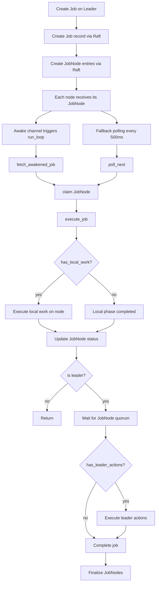

# Job System Architecture

## Overview
The job system provides distributed background execution across the cluster. A job is represented in the system tables (`system.jobs`) and is fanned out into per-node entries (`system.job_nodes`). The design supports:

- Leader-only job creation (single source of truth).
- Per-node local execution (RocksDB/CPU work on each node).
- Leader-only actions for external storage and shared metadata.
- Immediate job dispatch via an awake channel, with polling as a fallback.
- Crash recovery and leader failover handling.

This document reflects the current implementation in:
- [backend/crates/kalamdb-core/src/jobs/jobs_manager/actions.rs](../../backend/crates/kalamdb-core/src/jobs/jobs_manager/actions.rs)
- [backend/crates/kalamdb-core/src/jobs/jobs_manager/runner.rs](../../backend/crates/kalamdb-core/src/jobs/jobs_manager/runner.rs)
- [backend/crates/kalamdb-commons/src/models/job_type.rs](../../backend/crates/kalamdb-commons/src/models/job_type.rs)

## Core Concepts

### Job Records
- **Job**: global state for a job, stored in `system.jobs`.
- **JobNode**: per-node execution state for a job, stored in `system.job_nodes`.

### Job Types
Each `JobType` encodes whether it has local work, leader actions, or is leader-only:

- `has_local_work()` — local node operations (RocksDB compaction, eviction, etc.).
- `has_leader_actions()` — external storage and shared metadata updates.
- `is_leader_only()` — leader actions only, no local work (leader creates a single JobNode).

See [backend/crates/kalamdb-commons/src/models/job_type.rs](../../backend/crates/kalamdb-commons/src/models/job_type.rs).

### Awake Channel
When a `CreateJobNode` command is applied, the state machine calls `awake_job()` on the local node. The run loop consumes this channel for instant dispatch, with a 500ms poll fallback for recovery and retries.

## Job Creation (Leader Only)

Job creation is leader-only to avoid multiple nodes orchestrating the same job. If a follower attempts to create a job, the system returns `NotLeader` with an optional leader API address for client redirection.

Creation flow:
1. Validate idempotency key (reject if already queued or running).
2. Create global `Job` in `system.jobs` via Raft.
3. Create `JobNode` entries via Raft:
   - **Leader-only job**: only for leader.
   - **All other jobs**: for all active cluster nodes.

Relevant code: [backend/crates/kalamdb-core/src/jobs/jobs_manager/actions.rs](../../backend/crates/kalamdb-core/src/jobs/jobs_manager/actions.rs)

## Job Execution Flow

The job loop runs on every node and processes both awakened jobs and fallback polling:

- Awakened jobs: pushed into a node-local channel on `CreateJobNode` apply.
- Poll fallback: scans for queued or retrying job_nodes every 500ms.

### Lifecycle Flow

### Key Phases

1. **Fetch & Claim**
   - `fetch_awakened_job()` or `poll_next()` retrieves the job and job_node.
   - The node claims its job_node via Raft.

2. **Local Phase (All Nodes)**
   - If `has_local_work()`, each node executes local tasks and updates its job_node.
   - If local work fails, the job_node is marked Failed; leader may mark job Failed.

3. **Leader Phase (Leader Only)**
   - Leader waits for quorum of job_nodes to complete (`active_cluster_node_ids()`).
   - If quorum is reached or timeout elapses, leader executes leader actions if required.
   - Leader sets global job status to Completed/Failed/Skipped.

## Quorum and Timeouts

- Quorum is `floor(n/2) + 1`, where `n` is the number of active nodes.
- Timeout is 10 seconds (`JOB_NODE_QUORUM_TIMEOUT_SECS`).
- If quorum times out, leader proceeds with leader actions (logged as warning).

## Retry Behavior

If a job returns `JobDecision::Retry`:
- The job status becomes `Retrying` (leader updates global job).
- The node updates its job_node to `Retrying`.
- After backoff, the node re-queues its job_node as `Queued`.

## Crash Recovery and Leader Failover

- On startup, `recover_incomplete_jobs()` marks running or retrying jobs as failed.
- When a node becomes leader, `handle_leader_failover()`:
  - Scans for `Running` and `Queued` jobs.
  - Marks queued jobs as running.
  - Resumes leader actions when possible.

## Statuses

Global job status (`system.jobs`):
- `New`, `Queued`, `Running`, `Retrying`, `Completed`, `Failed`, `Cancelled`, `Skipped`

Per-node job status (`system.job_nodes`):
- `Queued`, `Running`, `Retrying`, `Completed`, `Failed`, `Cancelled`, `Skipped`

## Single-Node vs Cluster Behavior

### Single Node
- The node is always the leader.
- JobNodes are created only for this node.
- Quorum is 1/1.

### Cluster
- Only the leader creates jobs and job_nodes.
- Each node runs local work for its own job_node.
- The leader waits for quorum and runs leader actions.

## Operational Notes

- Jobs are dispatched immediately via the awake channel; polling is only a fallback.
- Leader-only jobs are executed only on the leader (`JobType::is_leader_only()`).
- Follower attempts to create jobs must be routed to the leader (client should retry using `NotLeader` information).
