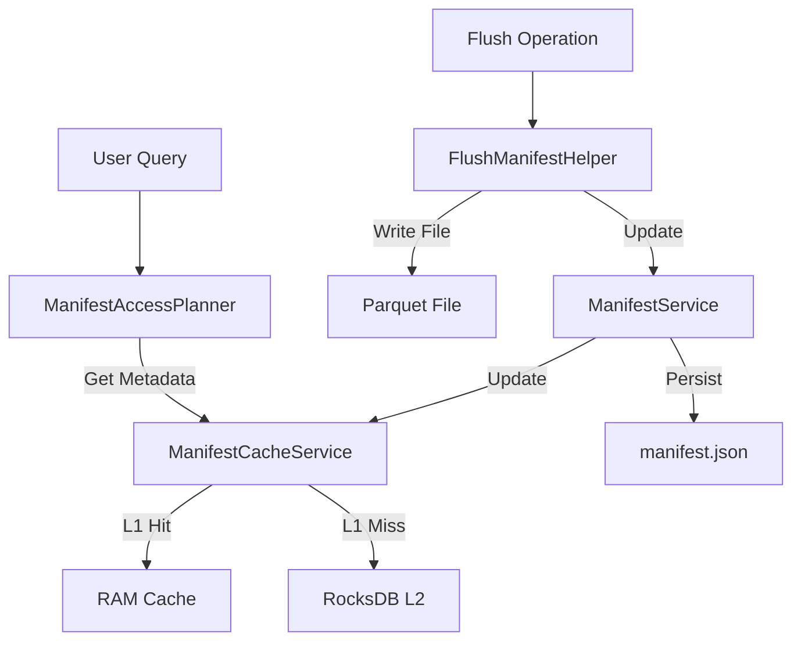

# Manifest Architecture & Lifecycle

## Overview

The Manifest system is the central nervous system of KalamDB's storage engine. It tracks the location, lifecycle, and statistics of all data segments (Parquet files) for every table. It serves two critical purposes:
1.  **Durability**: It is the single source of truth for what data exists in the system.
2.  **Optimization**: It enables **Data Skipping** (Pruning) during queries, drastically reducing I/O.

## Core Data Structures

### 1. The Manifest
A `Manifest` is a metadata object associated with a specific table scope (Namespace + Table + User/Shared).
- **Version**: Monotonically increasing version number (optimistic concurrency).
- **Segments**: A list of `SegmentMetadata` objects representing immutable data files.
- **Sequence Number**: The highest assigned `_seq` number, ensuring global ordering.

### 2. Segment Metadata
Each immutable Parquet file is represented by a `SegmentMetadata` object:
- **Path**: Relative path to the file (e.g., `batch-42.parquet`).
- **MVCC Range**: `min_seq` and `max_seq` for version control.
- **Column Statistics**: A map of `ColumnStats` (Min/Max/NullCount) for the primary key and indexed columns.
    - *Example*: If a segment has `age` range `[20, 30]`, a query for `WHERE age > 50` will skip this file entirely without opening it.

## Architecture: Hot vs. Cold Storage

KalamDB employs a tiered architecture to balance sub-millisecond latency with long-term durability.

### Hot Store (Metadata Cache)
*   **Purpose**: Instant access for query planning and active write coordination.
*   **Implementation**:
    *   **L1 Cache (RAM)**: `DashMap` in `ManifestCacheService`. Provides zero-copy read access.
    *   **L2 Cache (RocksDB)**: Persisted Key-Value store (`kalamdb-store`). Allows fast server restarts without parsing thousands of JSON files.
*   **Characteristics**: Volatile (L1) or Local-Persistent (L2). Always up-to-date.

### Cold Store (Durability Layer)
*   **Purpose**: Long-term archival, portability, and disaster recovery.
*   **Implementation**: `manifest.json` file stored alongside Parquet files.
*   **Format**: Human-readable JSON.
*   **Location**: Local Filesystem or Object Storage (S3).
*   **Characteristics**: Authoritative source of truth. Updated atomically.

## The Workflow

### 1. Ingestion (Write Path)
*   Incoming rows are written to the **WAL** and **MemTable** (RocksDB).
*   The Manifest is **NOT** updated for individual row inserts to prevent lock contention.
*   Data remains "in-flight" until a flush occurs.

### 2. Flush Operation (Commit)
When the MemTable fills up or a checkpoint is triggered:
1.  **Write Parquet**: In-memory rows are sorted and written to a new `batch-N.parquet` file.
2.  **Compute Stats**: `FlushManifestHelper` calculates min/max values for the primary key, `_seq`, and indexed columns *during* the write process.
3.  **Update Hot Store**: A new `SegmentMetadata` entry is added to the `ManifestService` (updating L1 RAM and L2 RocksDB).
4.  **Persist Cold Store**: The `ManifestService` serializes the updated state and performs an atomic write (write-tmp-rename) to `manifest.json`.

### 3. Query Execution (Read Path)
1.  **Plan**: The `ManifestAccessPlanner` requests the Manifest from the **Hot Store**.
2.  **Prune**: The planner evaluates the query predicates (e.g., `WHERE region = 'US-East'`) against the `column_stats` of each segment.
    *   *Result*: A list of only the relevant files is returned.
3.  **Scan**: DataFusion opens and reads only the pruned list of Parquet files.

### 4. Recovery & Startup
*   **Fast Path**: On startup, `ManifestCacheService` loads metadata directly from **RocksDB (L2)**. This is extremely fast.
*   **Slow Path (Cold Start)**: If RocksDB is empty (fresh node), the system reads `manifest.json` from the storage backend.
*   **Disaster Recovery**: If `manifest.json` is missing or corrupted, the `ManifestService` can scan the directory for `*.parquet` files and **rebuild** the manifest by reading the footers of every file.

## Component Interaction

## Key Components

| Component | Role | Location |
|-----------|------|----------|
| `ManifestService` | The authoritative manager. Handles coordination between Hot and Cold stores. | `kalamdb-core/src/manifest/service.rs` |
| `ManifestCacheService` | Manages the L1/L2 caching layers and eviction policies. | `kalamdb-core/src/manifest/cache_service.rs` |
| `FlushManifestHelper` | Computes statistics during flush and commits changes. | `kalamdb-core/src/manifest/flush_helper.rs` |
| `SegmentMetadata` | Data structure holding stats and paths. | `kalamdb-commons/src/models/types/manifest.rs` |
