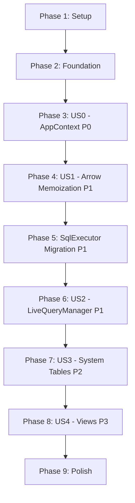

# Tasks: Core Architecture Refactoring v2

**Branch**: `010-core-architecture-v2`  
**Input**: Design documents from `/specs/010-core-architecture-v2/`  
**Prerequisites**: plan.md ✅, spec.md ✅, research.md ✅, data-model.md ✅, quickstart.md ✅

**Tests**: Tests are NOT explicitly requested in the specification. This task list focuses on implementation and existing test maintenance (477 tests must pass per FR-017).

**Organization**: Tasks are grouped by user story to enable independent implementation and testing of each story. Implementation follows strict order to avoid rework (see Implementation Order section).

## Format: `[ID] [P?] [Story] Description`

- **[P]**: Can run in parallel (different files, no dependencies)
- **[Story]**: Which user story this task belongs to (e.g., US0, US1, US2, US3, US4)
- Include exact file paths in descriptions

## Path Conventions

All paths are relative to `backend/crates/kalamdb-core/` unless otherwise specified.

---

## Phase 1: Setup (Shared Infrastructure)

**Purpose**: Verify project structure and prepare for refactoring

- [ ] T001 Verify cargo workspace compiles successfully (`cargo check --workspace`)
- [ ] T002 Run existing 477 kalamdb-core tests to establish baseline (`cargo test -p kalamdb-core`)
- [ ] T003 Create feature branch `010-core-architecture-v2` if not already created

---

## Phase 2: Foundational (Blocking Prerequisites)

**Purpose**: Core infrastructure that MUST be complete before ANY user story can be implemented

**⚠️ CRITICAL**: No user story work can begin until this phase is complete. These tasks establish the foundation for Arrow schema memoization.

- [ ] T004 Add `std::sync::RwLock` import to `src/schema_registry/schema_cache.rs`
- [ ] T005 [P] Add Clone semantics documentation comment to `CachedTableData` struct in `src/schema_registry/schema_cache.rs`
- [ ] T006 Verify all 11 TableProvider implementations compile before modifications (`cargo check -p kalamdb-core`)

**Checkpoint**: Foundation ready - user story implementation can now begin in strict sequential order (NOT parallel due to dependencies)

---

## Phase 3: User Story 0 - AppContext Centralization with NodeId (Priority: P0) 🎯 FOUNDATIONAL

**Goal**: Establish single source of truth for NodeId loaded from config.toml to eliminate inconsistent NodeId instantiations across components

**Independent Test**: Start server, inspect logs from multiple components (LiveQueryManager, job executors, audit logs), verify all log entries use identical NodeId loaded from config.toml

**Acceptance Criteria**:
- SC-000: NodeId is allocated exactly once per server instance
- SC-007: Zero duplicate NodeId instantiations detected in codebase

### Implementation for User Story 0

- [ ] T007 [US0] Add `node_id: Arc<NodeId>` field to `AppContext` struct in `backend/crates/kalamdb-core/src/app_context.rs`
- [ ] T008 [US0] Update `AppContext::init()` to accept `config: &Config` parameter in `backend/crates/kalamdb-core/src/app_context.rs`
- [ ] T009 [US0] Initialize `node_id` from `config.node_id` in `AppContext::init()` in `backend/crates/kalamdb-core/src/app_context.rs`
- [ ] T010 [US0] Add `pub fn node_id(&self) -> &Arc<NodeId>` getter method to `AppContext` in `backend/crates/kalamdb-core/src/app_context.rs`
- [ ] T011 [US0] Add `node_id` field to `Config` struct with default fallback in `backend/src/config.rs`
- [ ] T012 [US0] Update `config.toml` to include `node_id = "node-dev-01"` in `backend/config.toml`
- [ ] T013 [US0] Update `config.example.toml` with node_id documentation in `backend/config.example.toml`
- [ ] T014 [US0] Update `lifecycle::bootstrap()` to pass `&config` to `AppContext::init()` in `backend/src/lifecycle.rs`
- [ ] T015 [US0] Update test helpers to pass config to `AppContext::init()` in `backend/crates/kalamdb-core/src/test_helpers.rs`
- [ ] T016 [US0] Run tests to verify AppContext changes: `cargo test -p kalamdb-core --lib app_context`
- [ ] T017 [US0] Start server and verify logs show consistent NodeId from config.toml

**Checkpoint**: AppContext now owns NodeId (FR-000, FR-014 complete). Proceed to User Story 1.

---

## Phase 4: User Story 1 - Schema Registry Refactoring and Arrow Cache (Priority: P1) 🎯 MVP CORE

**Goal**: Achieve 50-100× performance improvement for schema lookups through Arrow schema memoization

**Independent Test**: Execute 1000 SELECT queries against the same table, verify zero schema reconstructions after initial cache load (1-2μs cached vs 50-100μs uncached)

**Acceptance Criteria**:
- SC-001: Arrow schema cache hit rate exceeds 99%
- SC-002: Schema lookup latency <2μs (memoized), 50-100× speedup
- SC-003: Memory overhead <2MB for 1000 tables
- SC-004: All 11 TableProvider implementations use memoized schemas

### Step 1: Directory Rename (FR-001)

- [ ] T018 [US1] Rename directory `src/schema/` to `src/schema_registry/` in `backend/crates/kalamdb-core/`
- [ ] T019 [US1] Update `src/lib.rs` to export `pub mod schema_registry;` (was `pub mod schema;`)
- [ ] T020 [US1] Find and replace all imports: `use kalamdb_core::schema::` → `use kalamdb_core::schema_registry::` across kalamdb-core

### Step 2: Add arrow_schema Field to CachedTableData (FR-002)

- [ ] T021 [US1] Add `arrow_schema: Arc<RwLock<Option<Arc<Schema>>>>` field to `CachedTableData` struct in `src/schema_registry/schema_cache.rs`
- [ ] T022 [US1] Update `CachedTableData::new()` constructor to initialize `arrow_schema: Arc::new(RwLock::new(None))` in `src/schema_registry/schema_cache.rs`

### Step 3: Implement arrow_schema() Method (FR-003)

- [ ] T023 [US1] Implement `CachedTableData::arrow_schema()` method with double-check locking pattern in `src/schema_registry/schema_cache.rs`
- [ ] T024 [US1] Add fast path: read lock → check Some → return Arc::clone in `arrow_schema()` method
- [ ] T025 [US1] Add slow path: write lock → double-check → compute via `to_arrow_schema()` → cache → return in `arrow_schema()` method
- [ ] T026 [US1] Add `.expect("RwLock poisoned")` handling for lock acquisition in `arrow_schema()` method

### Step 4: Implement SchemaCache Delegation (FR-003 continued)

- [ ] T027 [US1] Implement `SchemaCache::get_arrow_schema(&self, table_id: &TableId)` method in `src/schema_registry/schema_cache.rs`
- [ ] T028 [US1] Make `get_arrow_schema()` delegate to `cached_data.arrow_schema()` with proper error handling

### Step 5: Update Invalidation Methods (FR-004)

- [ ] T029 [US1] Verify `SchemaCache::invalidate()` signature is `&self` (not `&mut self`) for DashMap in `src/schema_registry/schema_cache.rs`
- [ ] T030 [US1] Add `self.providers.remove(table_id)` to `invalidate()` method in `src/schema_registry/schema_cache.rs`
- [ ] T031 [US1] Verify `clear()` method clears all DashMaps including providers in `src/schema_registry/schema_cache.rs`

### Step 6: Update TableProviderCore (FR-005)

- [ ] T032 [US1] Remove `pub schema: SchemaRef` field from `TableProviderCore` struct in `src/tables/base_table_provider.rs`
- [ ] T033 [US1] Update `TableProviderCore::new()` constructor to NOT require `schema` parameter in `src/tables/base_table_provider.rs`
- [ ] T034 [US1] Add `pub fn arrow_schema(&self) -> Result<Arc<Schema>>` method to `TableProviderCore` in `src/tables/base_table_provider.rs`
- [ ] T035 [US1] Make `arrow_schema()` delegate to `self.unified_cache.get_arrow_schema(&self.table_id)` in `src/tables/base_table_provider.rs`

### Step 7: Update All 11 TableProvider Implementations (FR-006)

**User Tables**:
- [ ] T036 [P] [US1] Update `UserTableAccess::schema()` to use `self.core.arrow_schema().expect("schema must be valid")` in `src/tables/user_tables/user_table_provider.rs`

**Shared Tables**:
- [ ] T037 [P] [US1] Update `SharedTableProvider::schema()` to use `self.core.arrow_schema().expect("schema must be valid")` in `src/tables/shared_tables/shared_table_provider.rs`

**Stream Tables**:
- [ ] T038 [P] [US1] Update `StreamTableProvider::schema()` to use `self.core.arrow_schema().expect("schema must be valid")` in `src/tables/stream_tables/stream_table_provider.rs`

**System Tables (8 providers)**:
- [ ] T039 [P] [US1] Update `UsersTableProvider::schema()` to use memoized schema in `src/tables/system/users/users_provider.rs`
- [ ] T040 [P] [US1] Update `JobsTableProvider::schema()` to use memoized schema in `src/tables/system/jobs/jobs_provider.rs`
- [ ] T041 [P] [US1] Update `NamespacesTableProvider::schema()` to use memoized schema in `src/tables/system/namespaces/namespaces_provider.rs`
- [ ] T042 [P] [US1] Update `StoragesTableProvider::schema()` to use memoized schema in `src/tables/system/storages/storages_provider.rs`
- [ ] T043 [P] [US1] Update `LiveQueriesTableProvider::schema()` to use memoized schema in `src/tables/system/live_queries/live_queries_provider.rs`
- [ ] T044 [P] [US1] Update `TablesTableProvider::schema()` to use memoized schema in `src/tables/system/tables/tables_provider.rs`
- [ ] T045 [P] [US1] Update `AuditLogsTableProvider::schema()` to use memoized schema in `src/tables/system/audit_logs/audit_logs_provider.rs`
- [ ] T046 [P] [US1] Update `StatsTableProvider::schema()` to use memoized schema in `src/tables/system/stats.rs`

### Step 8: Add Benchmark Test

- [ ] T047 [US1] Create `tests/test_arrow_schema_memoization.rs` with benchmark measuring 1000 repeated queries
- [ ] T048 [US1] Implement test asserting first call 50-100μs, subsequent calls <2μs, speedup >50× in benchmark test
- [ ] T049 [US1] Run benchmark test: `cargo test -p kalamdb-core test_arrow_schema_memoization_performance`

### Step 9: Validation

- [ ] T050 [US1] Run all kalamdb-core tests: `cargo test -p kalamdb-core` (must maintain 477/477 pass rate)
- [ ] T051 [US1] Verify benchmark shows 50-100× speedup in test output
- [ ] T052 [US1] Check memory usage via benchmark (must be <2MB for 1000 tables)

**Checkpoint**: Arrow schema memoization complete (FR-001 to FR-006, SC-001 to SC-004 achieved). This is the MVP core functionality.

---

## Phase 5: SqlExecutor Migration (Priority: P1 Foundation) 🔄 DEFERRED POST-MVP

**Goal**: Complete executor.rs → executor/mod.rs migration with AppContext dependencies (BLOCKED until Phase 3-4 complete)

**Independent Test**: All SQL queries execute via refactored executor with AppContext-based NodeId and schema access

**Note**: This user story was started but incomplete. Implementation deferred until foundations (US0, US1) are stable per Implementation Order.

### Implementation for SqlExecutor Migration

- [ ] T053 [US1] Audit `src/sql/executor/mod.rs` for incomplete AppContext integration patterns
- [ ] T054 [US1] Update all handler methods in `src/sql/executor/handlers/` to receive `&AppContext` parameter
- [ ] T055 [US1] Replace all `NodeId::from(format!("node-{}", pid))` calls with `app_context.node_id()` in executor handlers
- [ ] T056 [US1] Replace all schema lookups with `app_context.schema_registry().get_arrow_schema()` in executor handlers
- [ ] T057 [US1] Update `src/sql/executor/mod.rs` routing to pass `&app_context` to all handlers
- [ ] T058 [US1] Run SQL executor tests: `cargo test -p kalamdb-core --lib sql::executor`
- [ ] T059 [US1] Delete `src/sql/executor.rs` legacy file after confirming all tests pass

**Checkpoint**: SqlExecutor fully migrated to AppContext pattern (FR-015, FR-016 complete).

---

## Phase 6: User Story 2 - Unified Live Query Manager (Priority: P1)

**Goal**: Consolidate UserConnections, UserTableChangeDetector, and LiveQueryManager into single coherent component

**Independent Test**: Establish 100 concurrent WebSocket subscriptions, insert data, verify all clients receive notifications with zero subscription leaks

**Acceptance Criteria**:
- SC-005: LiveQueryManager consolidation reduces code by ≥30%

### Implementation for User Story 2

- [ ] T060 [P] [US2] Create new unified `LiveQueryManager` struct in `src/live_query/manager.rs` with merged fields (subscriptions, connections, filter_cache)
- [ ] T061 [P] [US2] Move `subscriptions: RwLock<LiveQueryRegistry>` from old LiveQueryManager to unified struct
- [ ] T062 [P] [US2] Move `connections: DashMap<ConnectionId, UserConnection>` from UserConnections to unified struct
- [ ] T063 [P] [US2] Move `filter_cache: RwLock<FilterCache>` from UserTableChangeDetector to unified struct
- [ ] T064 [US2] Add `schema_registry: Arc<SchemaRegistry>` field to unified LiveQueryManager
- [ ] T065 [US2] Add `node_id: Arc<NodeId>` field from AppContext to unified LiveQueryManager
- [ ] T066 [US2] Implement `connect()` method adding connection to `connections` map
- [ ] T067 [US2] Implement `subscribe()` method registering subscription with filter compilation
- [ ] T068 [US2] Implement `on_table_change()` method matching filters and sending notifications
- [ ] T069 [US2] Implement atomic `handle_disconnect()` method removing connection + subscriptions + filters in one operation
- [ ] T070 [US2] Update AppContext to use unified LiveQueryManager in `src/app_context.rs`
- [ ] T071 [US2] Remove old UserConnections, UserTableChangeDetector structs (mark deprecated with migration notes)
- [ ] T072 [US2] Update WebSocket handlers to use unified LiveQueryManager in `backend/crates/kalamdb-api/src/websocket/`
- [ ] T073 [US2] Run live query tests: `cargo test -p kalamdb-core --lib live_query`
- [ ] T074 [US2] Measure code reduction (count lines before/after, verify ≥30% reduction)

**Checkpoint**: LiveQueryManager consolidation complete (FR-007, FR-008, SC-005 achieved).

---

## Phase 7: User Story 3 - System Tables as Regular Storage (Priority: P2)

**Goal**: Store system tables (users, jobs, namespaces, storages, live_queries, tables) using same RocksDB/Parquet architecture as shared tables

**Independent Test**: Create namespace, insert into system.users, flush to Parquet, restart server, verify system.users data persists and is queryable

**Acceptance Criteria**:
- SC-006: System table queries perform within 10% of shared table queries
- SC-010: System table initialization completes in <100ms

### Implementation for User Story 3

- [ ] T075 [P] [US3] Add `system:schema_version` key storage in RocksDB for schema versioning
- [ ] T076 [P] [US3] Create `SystemSchemaVersion` struct in `backend/crates/kalamdb-commons/src/system_tables.rs`
- [ ] T077 [US3] Implement `initialize_system_tables()` function with version comparison logic
- [ ] T078 [US3] Add schema version constants: `const CURRENT_SCHEMA_VERSION: u32 = 1;`
- [ ] T079 [US3] Implement upgrade logic: if stored_version < current_version, create missing tables
- [ ] T080 [US3] Update system table providers to use `StorageBackend` trait (same as shared tables)
- [ ] T081 [P] [US3] Update UsersTableProvider to support flush operations in `src/tables/system/users/users_provider.rs`
- [ ] T082 [P] [US3] Update JobsTableProvider to support flush operations in `src/tables/system/jobs/jobs_provider.rs`
- [ ] T083 [P] [US3] Update NamespacesTableProvider to support flush operations in `src/tables/system/namespaces/namespaces_provider.rs`
- [ ] T084 [P] [US3] Update StoragesTableProvider to support flush operations in `src/tables/system/storages/storages_provider.rs`
- [ ] T085 [P] [US3] Update LiveQueriesTableProvider to support flush operations in `src/tables/system/live_queries/live_queries_provider.rs`
- [ ] T086 [P] [US3] Update TablesTableProvider to support flush operations in `src/tables/system/tables/tables_provider.rs`
- [ ] T087 [US3] Call `initialize_system_tables()` during `lifecycle::bootstrap()` in `backend/src/lifecycle.rs`
- [ ] T088 [US3] Add system table flush job support in `src/jobs/executors/flush.rs`
- [ ] T089 [US3] Test system table persistence: insert → flush → restart → query
- [ ] T090 [US3] Benchmark system table query performance vs shared tables (must be within 10%)
- [ ] T091 [US3] Measure initialization time on startup (must be <100ms)

**Checkpoint**: System tables use standard storage (FR-009, FR-010, SC-006, SC-010 achieved).

---

## Phase 8: User Story 4 - Virtual Views Support (Priority: P3)

**Goal**: Enable developers to define and query views as alternative schemas over existing tables without physical storage

**Independent Test**: Create view `v_active_users` over system.users filtering deleted_at IS NULL, query view, verify results match underlying table filter

**Acceptance Criteria**:
- SC-009: View queries return results within 5% of direct table query performance

### Implementation for User Story 4

- [ ] T092 [P] [US4] Create `ViewDefinition` struct in `backend/crates/kalamdb-commons/src/models/schemas/view.rs`
- [ ] T093 [P] [US4] Add fields: `view_name`, `namespace`, `sql_definition`, `dependent_table_ids`, `created_at`, `created_by`
- [ ] T094 [US4] Extend system.tables to support `table_type='VIEW'` storage
- [ ] T095 [US4] Implement `SchemaRegistry::register_view()` method in `src/schema_registry/registry.rs`
- [ ] T096 [US4] Implement view dependency tracking (extract table IDs from SQL definition)
- [ ] T097 [US4] Implement query-time view validation (check dependent tables exist)
- [ ] T098 [US4] Add `ViewTableProvider` struct wrapping underlying table query rewriting
- [ ] T099 [US4] Implement `CREATE VIEW` support in DDL executor handlers
- [ ] T100 [US4] Implement `DROP VIEW` support in DDL executor handlers
- [ ] T101 [US4] Add view cache invalidation when dependent tables change
- [ ] T102 [US4] Implement transparent query rewriting: `SELECT * FROM v_name` → underlying SQL
- [ ] T103 [US4] Test view creation: `CREATE VIEW v_active_users AS SELECT * FROM system.users WHERE deleted_at IS NULL`
- [ ] T104 [US4] Test view query: `SELECT * FROM v_active_users` returns filtered results
- [ ] T105 [US4] Test broken view: drop underlying table, query view, verify clear error message
- [ ] T106 [US4] Benchmark view query performance vs direct table query (must be within 5%)

**Checkpoint**: Views support complete (FR-011 to FR-013, SC-009 achieved).

---

## Phase 9: Polish & Cross-Cutting Concerns

**Purpose**: Final validation, performance optimization, and documentation updates

- [ ] T107 Run full test suite across all crates: `cargo test --workspace`
- [ ] T108 Verify all 477 kalamdb-core tests pass (FR-017): `cargo test -p kalamdb-core`
- [ ] T109 Run clippy lints: `cargo clippy --workspace -- -D warnings`
- [ ] T110 Run cargo fmt: `cargo fmt --all -- --check`
- [ ] T111 Update AGENTS.md with Phase 10 completion status in `AGENTS.md`
- [ ] T112 [P] Add performance benchmark results to spec.md Clarifications section
- [ ] T113 [P] Update quickstart.md with any lessons learned during implementation
- [ ] T114 [P] Create migration guide for external kalamdb-core consumers (if applicable)
- [ ] T115 Final code review: verify zero `NodeId::from(format!("node-{}", pid))` patterns remain
- [ ] T116 Final code review: verify all 11 TableProvider implementations use memoized schemas
- [ ] T117 Final code review: verify SchemaCache renamed to SchemaRegistry throughout (if rename completed)
- [ ] T118 Merge feature branch to main after all validations pass

**Checkpoint**: Phase 10 refactoring complete, all success criteria met.

---

## Dependencies & Implementation Order

### Critical Path (MUST follow this order)

**Strict Order Enforcement**:
1. ⚠️ US0 MUST complete before US1 (AppContext foundation required)
2. ⚠️ US1 MUST complete before SqlExecutor (schema_registry + Arrow memoization required)
3. ⚠️ SqlExecutor MUST complete before US2 (executor patterns inform LiveQueryManager)
4. ✅ US2 CAN parallelize with US3 (independent components)
5. ✅ US3 MUST complete before US4 (system.tables stores view definitions)

**User Story Dependencies**:
- **US0 (AppContext)**: No dependencies - can start immediately after foundation
- **US1 (Arrow Memoization)**: Depends on US0 (requires AppContext singleton)
- **SqlExecutor**: Depends on US0 + US1 (requires both AppContext and schema_registry)
- **US2 (LiveQueryManager)**: Depends on SqlExecutor (uses AppContext patterns)
- **US3 (System Tables)**: Depends on US2 (uses StorageBackend patterns)
- **US4 (Views)**: Depends on US3 (stores view metadata in system.tables)

### Parallel Execution Opportunities

**Within US1 (TableProvider Updates)**:
- T036-T046 can run in parallel (11 different provider files)

**Within US2 (LiveQueryManager)**:
- T060-T063 can run in parallel (creating struct fields independently)

**Within US3 (System Table Providers)**:
- T081-T086 can run in parallel (6 different provider files)

**Within US4 (Views)**:
- T092-T093 can run in parallel (model creation and validation)

**Across User Stories**:
- ⚠️ NO parallelization across US0, US1, SqlExecutor, US2 (strict sequential dependency)
- ✅ US2 and US3 CAN overlap IF US2 executor work is complete
- ✅ Polishing tasks (T112-T114) can run in parallel

---

## MVP Scope Recommendation

**Minimum Viable Product**: Phase 3 (US0) + Phase 4 (US1) + Phase 5 (SqlExecutor partial)

This delivers:
- ✅ AppContext centralization (consistent NodeId across all logs)
- ✅ 50-100× schema lookup performance improvement
- ✅ Foundation for all subsequent refactoring

**Suggested Incremental Delivery**:
1. **Sprint 1**: US0 + US1 (2-3 days) - Core performance win
2. **Sprint 2**: SqlExecutor migration (2-3 days) - Architecture cleanup
3. **Sprint 3**: US2 LiveQueryManager (2 days) - Component consolidation
4. **Sprint 4**: US3 System Tables (3 days) - Storage unification
5. **Sprint 5**: US4 Views (2-3 days) - Feature enhancement

Total estimated effort: 11-14 days for complete Phase 10 refactoring.

---

## Task Summary

- **Total Tasks**: 118
- **Setup & Foundation**: 6 tasks (T001-T006)
- **User Story 0 (P0)**: 11 tasks (T007-T017)
- **User Story 1 (P1)**: 35 tasks (T018-T052) - Largest phase (Arrow memoization)
- **SqlExecutor Migration**: 7 tasks (T053-T059)
- **User Story 2 (P1)**: 15 tasks (T060-T074)
- **User Story 3 (P2)**: 17 tasks (T075-T091)
- **User Story 4 (P3)**: 15 tasks (T092-T106)
- **Polish & Cross-Cutting**: 12 tasks (T107-T118)

**Parallel Opportunities**: 23 tasks marked [P] can run in parallel within their phases

**Independent Test Criteria**: Each user story phase includes specific acceptance test that can be executed independently to verify functionality.

**Format Validation**: ✅ All 118 tasks follow the required checklist format with IDs, optional [P] markers, [Story] labels, and file paths.
